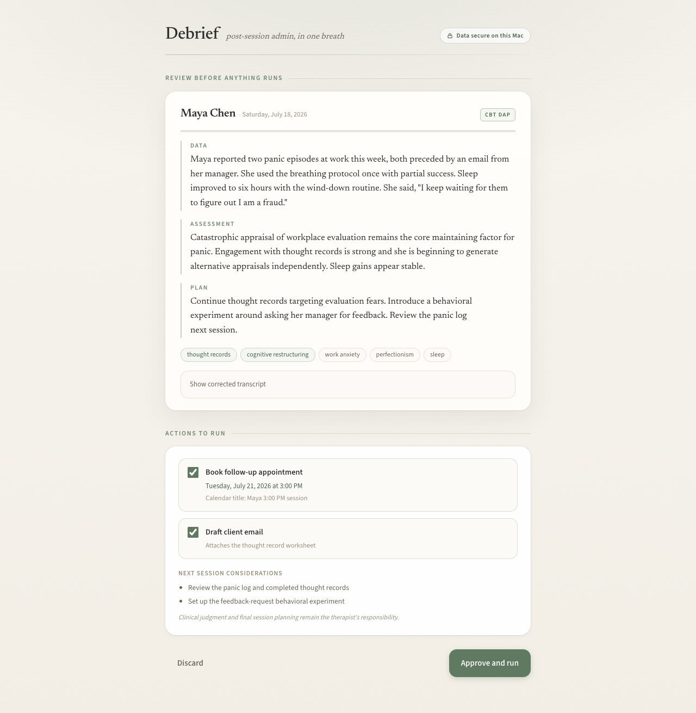
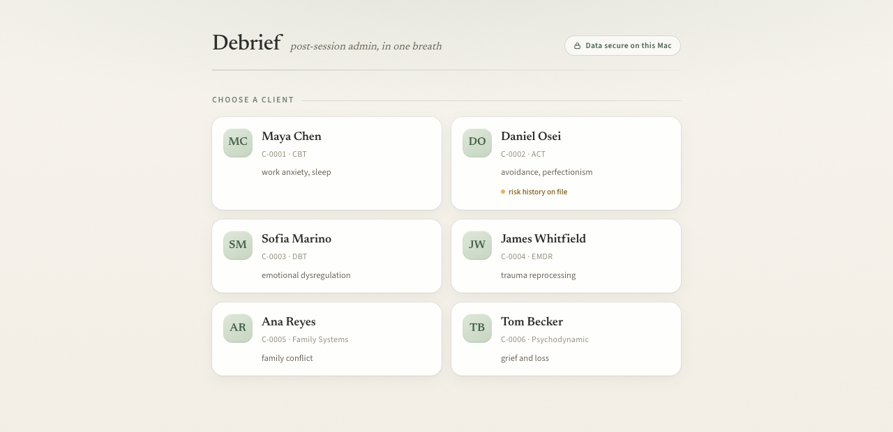
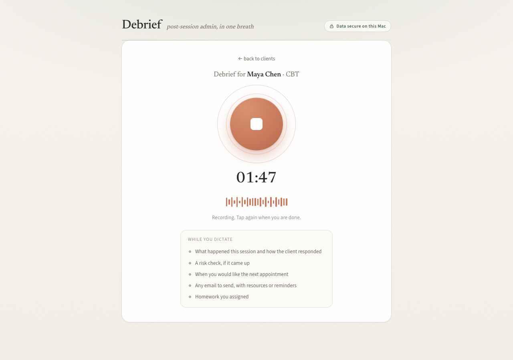
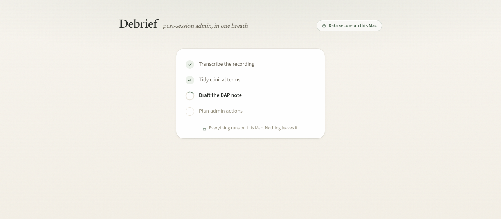
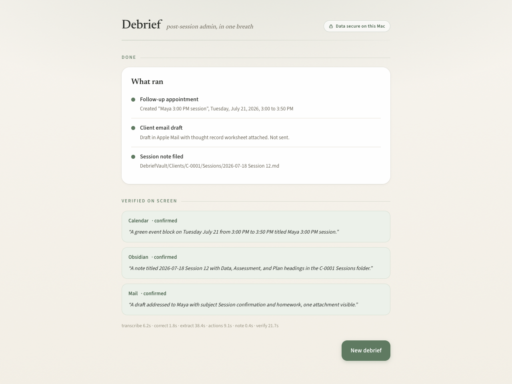

# Debrief

One spoken debrief after each therapy session. Debrief writes the progress note, books the follow-up, drafts the client email, and verifies it all on screen. Everything runs locally on your Mac with Gemma 4.

> **2nd place, Build with Gemma: JustBuild hackathon (July 2026)**, Track 2: Voice-to-Action Agents. The frozen winning build is tagged [`v0.1-hackathon`](https://github.com/fomoPhil/case-notes/releases/tag/v0.1-hackathon). The full submission writeup is in [WRITEUP.md](WRITEUP.md).



<p>
  
  
  
  
  
</p>

## What it does

After every session, a solo therapist loses 15 to 30 minutes to admin. Debrief turns one 60 to 90 second spoken debrief into all of it:

1. **Files an audit-ready DAP progress note** into a plain-markdown client vault, grounded in the transcript with verbatim client quotes, framework-authentic vocabulary (CBT, ACT, DBT, family systems, EMDR, psychodynamic), and a mandatory structured risk section whenever suicidal ideation is mentioned.
2. **Books the follow-up** in Apple Calendar (the resolved date and time are shown for approval first).
3. **Drafts the client email** in Apple Mail with the worksheet attached. Always a draft, never auto-sent.
4. **Verifies it on screen**: it screenshots Calendar, the note, and Mail, and Gemma 4 vision reads the live screen to confirm each action actually happened.

It also includes a **Clinician Voice Journal**: between sessions, dictate an observation or session-prep thought and it becomes a dated draft in that client's folder. Journal entries never schedule, email, or send anything.

All processing happens locally on your Mac; recordings and notes never leave the device. The demo data is fictional.

## How it works

The architecture principle is **deterministic hands, model brain, model eyes.**

- **Brain**: Gemma 4 12B (QAT, via LM Studio) makes one JSON-schema-constrained call that extracts the clinical note and the requested actions from the transcript. It is also the editor (a glossary pass fixes clinical-term transcription errors) and the eyes (its vision reads the verification screenshots).
- **Hands**: actions execute through deterministic code only (atomic file writes, AppleScript). The model never does date math: it copies the spoken time phrase ("next Tuesday at 3") and Python resolves it, with the absolute datetime shown in an approval checklist before anything runs. A dedup guard makes double-booking impossible.
- **Stack**: FastAPI server + single-file vanilla JS web UI + a plain markdown vault + LM Studio for the model + parakeet-mlx for fully offline speech-to-text on Apple Silicon.

This split is why a 12B local model is enough to run a reliable agent.

The vault is plain markdown files on disk. [Obsidian](https://obsidian.md) is a nice optional viewer for it, not a dependency.

## Requirements

- Apple Silicon Mac
- [LM Studio](https://lmstudio.ai) with the Gemma model loaded at 64k context:

  ```bash
  lms load gemma-4-12b-it-qat --context-length 64000 -y
  ```

- macOS Automation permissions for Calendar and Mail, plus Screen Recording for the vision verification step (macOS prompts on first use)
- [uv](https://docs.astral.sh/uv/) and ffmpeg

## Quickstart

```bash
uv sync
uv run debrief
```

First run downloads the speech-to-text model (a few hundred MB); after that everything works fully offline (set HF_HUB_OFFLINE=1 to force it).

Open http://127.0.0.1:8377. The client vault scaffolds itself on first run with three fictional clients. Pick one, record a spoken debrief, review the note and action plan, and approve it.

For development you can also run the server directly with `HF_HUB_OFFLINE=1 .venv/bin/python app.py`. To check your setup at any time, run `uv run debrief-doctor`.

## Roadmap

An in-app voice assistant for open-ended requests, a client records UI, and a one-command install are in progress.

## License

MIT. See [LICENSE](LICENSE).
